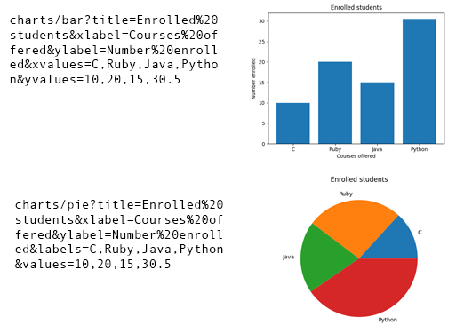

This sample Python Flask application builds a Charts API by using [APIFlask](https://apiflask.com/) with [matplotlib](https://matplotlib.org/) to return charts as PNG images.
You can use this project as a starting point for your own Flask APIs.



The repository is designed for use with [Docker containers](https://www.docker.com/), both for local development and deployment, and includes infrastructure files for deployment to [Azure Container Apps](https://learn.microsoft.com/azure/container-apps/overview). 🐳

The code is
tested with [pytest](https://docs.pytest.org/en/7.2.x/) and [schemathesis](https://schemathesis.readthedocs.io/en/stable/),
linted with [ruff](https://github.com/charliermarsh/ruff), and formatted with [black](https://black.readthedocs.io/en/stable/).
Code quality issues are all checked with both [pre-commit](https://pre-commit.com/) and Github actions.


## Opening the project

This project has [Dev Container support](https://code.visualstudio.com/docs/devcontainers/containers), so it will be be setup automatically if you open it in Github Codespaces or in local VS Code with the [Dev Containers extension](https://marketplace.visualstudio.com/items?itemName=ms-vscode-remote.remote-containers).

If you're not using one of those options for opening the project, then you'll need to:

1. Create a [Python virtual environment](https://docs.python.org/3/tutorial/venv.html#creating-virtual-environments) and activate it.

2. Install the requirements:

    ```shell
    python3 -m pip install -r requirements-dev.txt
    ```

3. Install the pre-commit hooks:

    ```shell
    pre-commit install
    ```


## Local development

1. Run the local server:

    ```shell
    python3 -m flask --debug --app src/api:app run --port 50505
    ```

2. Click 'http://127.0.0.1:50505' in the terminal, which should open a new tab in the browser.

3. Open the API specification at `/openapi.json`

4. Try the API at these sample URLs:

    `charts/bar?title=Enrolled%20students&xlabel=Courses%20offered&ylabel=Number%20enrolled&xvalues=C,Ruby,Java,Python&yvalues=10,20,15,30.5`

    `charts/pie?title=Enrolled%20students&xlabel=Courses%20offered&ylabel=Number%20enrolled&labels=C,Ruby,Java,Python&values=10,20,15,30.5`


### Local development with Docker

You can also run this app locally with Docker, thanks to the `Dockerfile`.
You need to either have Docker Desktop installed or have this open in Github Codespaces for these commands to work.

1. Install [Docker Desktop](https://www.docker.com/products/docker-desktop/). If you opened this inside Github Codespaces or a Dev Container in VS Code, installation is not needed. ⚠️ If you're on an Apple M1/M2, you won't be able to run `docker` commands inside a Dev Container; either use Codespaces or do not open the Dev Container.

2. Build the image:

    ```shell
    docker build --tag flask-api src/
    ```

3. Run the image:

    ```shell
    docker run --publish 50505:50505 flask-api
    ```

4. Follow instructions above to test the API is working.

## Running tests

This project uses [pytest](https://docs.pytest.org/en/stable/) for testing and [coverage](https://pypi.org/project/coverage/) for test coverage. Both are configured in `pyproject.toml`.

Run the unit tests:

```shell
python3 -m pytest
```

This project also uses [schemathesis](https://schemathesis.readthedocs.io/en/stable/) to run property-based tests based on the generated OpenAPI schema.

Run property-based tests:

```shell
python3 -m pytest src/tests/property_based.py
```

Both commands are also run as part of the CI/CD pipeline. If test coverage falls below 100%s, the pipeline will fail.

## Deployment

This repo is set up for deployment on [Azure Container Apps](https://learn.microsoft.com/azure/container-apps/overview) using the configuration files in the `infra` folder.

This diagram shows the architecture of the deployment:


Steps for deployment:

1. Sign up for a [free Azure account](https://azure.microsoft.com/free/)
2. Install the [Azure Dev CLI](https://learn.microsoft.com/azure/developer/azure-developer-cli/install-azd). (If you opened this repository in a devcontainer, that part will be done for you.)
3. Initialize a new `azd` environment:

    ```shell
    azd init
    ```

    It will prompt you to provide a name (like "flask-app") that will later be used in the name of the deployed resources.
    
4. Provision and deploy all the resources:

    ```shell
    azd up
    ```

    It will prompt you to login, pick a subscription, and provide a location (like "eastus"). Then it will provision the resources in your account and deploy the latest code.

5. When `azd` has finished deploying, you'll see an endpoint URI in the command output. Visit that URI and append `charts/bar?xvalues=C,Ruby,Java,Python&yvalues=10,20,15,30.5` to see a bar chart PNG.

6. When you've made any changes to the app code, you can just run:

    ```shell
    azd deploy
    ```

## CI/CD pipeline

This project includes a Github workflow for deploying the resources to Azure
on every push to main. That workflow requires several Azure-related authentication secrets
to be stored as Github action secrets. To set that up, run:

```shell
azd pipeline config
```


### Costs

Pricing varies per region and usage, so it isn't possible to predict exact costs for your usage.
The majority of the Azure resources used in this infrastructure are on usage-based pricing tiers.
However, Azure Container Registry has a fixed cost per registry per day.

You can try the [Azure pricing calculator](https://azure.com/e/fb285cfc051547899f4535cc0f41dc01) for the resources:

- Azure Container App: Consumption tier with 0.5 CPU, 1GiB memory/storage. Pricing is based on resource allocation, and each month allows for a certain amount of free usage. [Pricing](https://azure.microsoft.com/pricing/details/container-apps/)
- Azure Container Registry: Basic tier. [Pricing](https://azure.microsoft.com/pricing/details/container-registry/)
- Azure CDN: Standard tier. [Pricing](https://azure.microsoft.com/pricing/details/cdn/)
- Key Vault: Standard tier. Costs are per transaction, a few transactions are used on each deploy. [Pricing](https://azure.microsoft.com/pricing/details/key-vault/)
- Log analytics: Pay-as-you-go tier. Costs based on data ingested. [Pricing](https://azure.microsoft.com/pricing/details/monitor/)

⚠️ To avoid unnecessary costs, remember to take down your app if it's no longer in use,
either by deleting the resource group in the Portal or running `azd down`.

## Getting help

If you're working with this project and running into issues, please post in **Discussions**.
